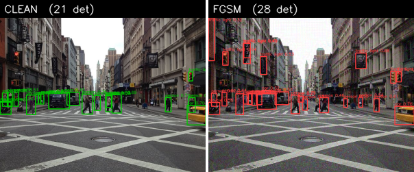
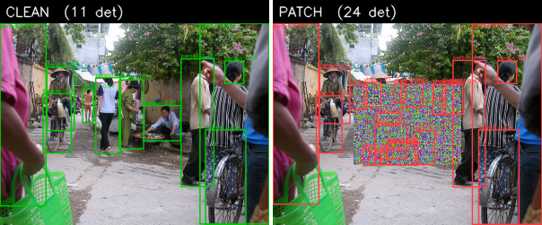
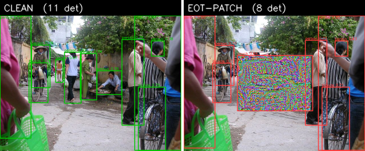
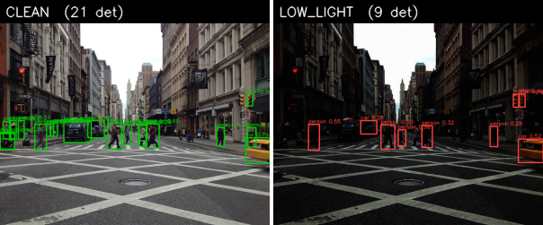
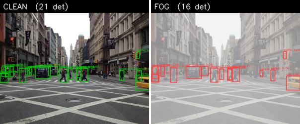
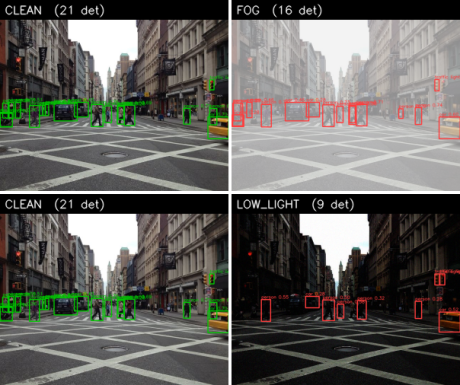

# Proving Ground AI — Robustness Testing Engine

[](https://github.com/vittesh12345/Defense/actions/workflows/ci.yml)

Stress-tests object-detection models (YOLO, etc.) with adversarial attacks and
degradations, measures the failure, and emits a reproducible JSON assurance
report. The output is **measurement** — correctness and reproducibility beat
speed.

It ships several attacks — white-box **FGSM** (single-step generic gradient),
**PGD-Linf** (the standard iterative FGSM at the same L-inf budget — strictly
stronger), **PGD-L2** (the L2-ball mirror of PGD-Linf — eps budgets the L2 norm
of the whole perturbation, often a more realistic similarity metric than L-inf),
an **optimized patch**, and an **EOT patch** (Expectation Over Transformation:
a localized patch trained to survive being printed and re-photographed at
different scales, angles, and lighting), plus a black-box **degradation**
family (DVE: gaussian/motion blur, gaussian noise, fog, low light, JPEG
compression, smoke, dust) that simulates real sensor and weather conditions —
including battlefield obscurants and brownout.

## Results

Pooled mAP@0.5 of `yolov8n` over a small set of cluttered, hand-annotated CC0
scenes (`proving_ground/data/fixtures/coco_scenes/`, **6 images**, clean =
**0.29** — a believable baseline, not a toy 1.0). Every attack measurably
degrades detection.

**White-box attacks:**

| Attack | Clean mAP | Attacked mAP | Δ (drop) |
|---|---|---|---|
| fgsm | 0.29 | 0.07 | 0.22 |
| pgd-linf | 0.29 | 0.01 | 0.28 |
| pgd-l2 | 0.29 | 0.03 | 0.27 |
| patch | 0.29 | 0.07 | 0.22 |
| eot-patch | 0.29 | 0.10 | 0.19 |

**Black-box degradation (DVE), at severity 0.8** — simulated sensor/weather
conditions (incl. battlefield smoke and brownout dust):

| Degradation | Clean mAP | Attacked mAP | Δ (drop) |
|---|---|---|---|
| motion_blur | 0.29 | 0.06 | 0.23 |
| gaussian_noise | 0.29 | 0.08 | 0.21 |
| dust | 0.29 | 0.13 | 0.16 |
| low_light | 0.29 | 0.13 | 0.16 |
| jpeg_compression | 0.29 | 0.18 | 0.11 |
| smoke | 0.29 | 0.19 | 0.10 |
| gaussian_blur | 0.29 | 0.22 | 0.07 |
| fog | 0.29 | 0.23 | 0.06 |

Full severity sweep (attacked mAP@0.5 by severity; higher severity ⇒ more
degradation, monotonic-ish — mild blur can even raise mAP slightly by suppressing
spurious detections). Locked in `tests/baselines/coco_scenes_degradation.json`:

| Degradation mode | sev 0.25 | sev 0.50 | sev 0.80 |
|---|---|---|---|
| motion_blur | 0.10 | 0.05 | 0.06 |
| gaussian_noise | 0.28 | 0.11 | 0.08 |
| dust | 0.27 | 0.11 | 0.13 |
| low_light | 0.33 | 0.22 | 0.13 |
| jpeg_compression | 0.29 | 0.23 | 0.18 |
| smoke | 0.21 | 0.17 | 0.19 |
| gaussian_blur | 0.30 | 0.33 | 0.22 |
| fog | 0.27 | 0.32 | 0.23 |

Reproduce a single mode at a chosen severity (used for the severity sweep
above), e.g.:

```bash
.venv/bin/python -m proving_ground.cli run \
  --images proving_ground/data/fixtures/coco_scenes/images \
  --ann   proving_ground/data/fixtures/coco_scenes/annotations.json \
  --model yolov8n.pt --attack degradation --mode fog --severity 0.8 --out fog.json
```

The EOT patch drops less *at its clean placement* because it trades peak damage
for **robustness under transformation** — it keeps degrading detection when the
patch is re-rendered at scales/rotations held out from training (see
`tests/test_eot_patch_snapshot.py`). The headline white-box + DVE drop tables
(both at their locked severity) are produced together by `bench` and locked in
`tests/baselines/coco_scenes_benchmark.json`; reproduce them with:

```bash
.venv/bin/python -m proving_ground.cli bench \
  --images proving_ground/data/fixtures/coco_scenes/images \
  --ann   proving_ground/data/fixtures/coco_scenes/annotations.json \
  --model yolov8n.pt --out results.json
```

### Confidence intervals

Single-seed point estimates are easy to challenge, so `bench --seeds K` (K > 1)
adds error bars two independent ways: a **seed sweep** (sensitivity to each
attack's randomness — deterministic attacks honestly show a zero-width interval)
and an **image bootstrap** (1000 resamples — "would different images change the
number", which also surfaces the small-fixture uncertainty). Locked in
`tests/baselines/coco_scenes_benchmark_ci.json`:

| Attack | Attacked mAP (mean) | Seed 95% CI | Image-bootstrap 95% CI |
|---|---|---|---|
| fgsm | 0.074 | [0.074, 0.074] | [0.019, 0.215] |
| pgd-linf | 0.013 | [0.013, 0.013] | [0.000, 0.072] |
| pgd-l2 | 0.025 | [0.025, 0.025] | [0.002, 0.115] |
| patch | 0.072 | [0.072, 0.072] | [0.003, 0.116] |
| eot-patch | 0.103 | [0.067, 0.139] | [0.007, 0.132] |
| gaussian_blur | 0.220 | [0.220, 0.220] | [0.101, 0.682] |
| motion_blur | 0.061 | [0.061, 0.061] | [0.003, 0.393] |
| gaussian_noise | 0.073 | [0.070, 0.076] | [0.019, 0.400] |
| fog | 0.232 | [0.232, 0.232] | [0.150, 0.402] |
| low_light | 0.171 | [0.117, 0.226] | [0.047, 0.405] |
| jpeg_compression | 0.176 | [0.176, 0.176] | [0.074, 0.400] |
| smoke | 0.217 | [0.123, 0.312] | [0.125, 0.418] |
| dust | 0.230 | [0.179, 0.281] | [0.042, 0.453] |

Clean mAP = 0.29, image-bootstrap 95% CI [0.091, 0.480] — the intervals stay wide
even at 6 images because the scenes are genuinely heterogeneous (cyclist 1.00 vs
the cafe/bus-stop silhouettes ~0.12), so the bootstrap honestly reports high
scene-to-scene variance. Reproduce with `bench --seeds 5 --bootstrap 1000`.

### Comparing models — and an honest methodology caveat

`compare` runs the identical attack suite across several detectors and ranks them
by the fraction of performance *retained* under attack — the cross-vendor
robustness scorecard:

```bash
.venv/bin/python -m proving_ground.cli compare \
  --images proving_ground/data/fixtures/coco_scenes/images \
  --ann   proving_ground/data/fixtures/coco_scenes/annotations.json \
  --models yolov8n.pt,yolov8s.pt,yolov8m.pt --out scorecard.json
```

**A credible cross-model ranking requires _complete_ ground truth.** Our
`coco_scenes` fixtures use a *salient* annotation standard (clearly-visible
objects only), which biases comparison **against more capable models**: a
higher-recall model detects more real-but-unlabelled objects, which score as
false positives and deflate its mAP. On these fixtures the *smallest* model
(yolov8n) even shows the *highest* clean mAP — an annotation artifact, not a real
result. (Within a *single* model, clean-vs-attacked degradation is unaffected and
stays valid.)

**The credible path: run on COCO val2017**, which is exhaustively annotated.
`tools/fetch_coco_val.py` grabs a deterministic subset (first N images by id;
COCO images carry mixed licenses so none are committed), then point
`compare`/`bench` at it with `--coco`:

```bash
python tools/fetch_coco_val.py --out-dir coco_val --limit 100
.venv/bin/python -m proving_ground.cli compare --coco --limit 100 \
  --images coco_val/val2017 --ann coco_val/annotations/instances_val2017.json \
  --models yolov8n.pt,yolov8s.pt,yolov8m.pt --out scorecard.json
.venv/bin/python -m proving_ground.cli report --in scorecard.json --out scorecard.html
```

Example result (50 COCO val images, reduced attack set) — note the ranking is
*sane* on complete labels (bigger = more accurate **and** more robust), unlike
the salient-GT artifact above:

| Rank | Model | Clean mAP | Mean attacked | Retained | Weakest vs |
|---|---|---|---|---|---|
| 1 | yolov8m | 0.55 | 0.36 | 64% | pgd-linf |
| 2 | yolov8s | 0.48 | 0.29 | 60% | pgd-linf |
| 3 | yolov8n | 0.38 | 0.20 | 52% | pgd-linf |

The loader maps COCO categories to the detector's classes by name (robust to
COCO's gappy ids).

### Client-readable report

Turn any `bench`/`compare` results JSON into a self-contained, color-coded HTML
one-pager (for a non-engineer reader):

```bash
.venv/bin/python -m proving_ground.cli bench \
  --images proving_ground/data/fixtures/coco_scenes/images \
  --ann   proving_ground/data/fixtures/coco_scenes/annotations.json \
  --model yolov8n.pt --out results.json
.venv/bin/python -m proving_ground.cli report --in results.json --out report.html \
  --title "yolov8n Robustness"
```

### TEVV assurance verdict

`tevv` judges a `bench` result against **acceptance criteria** and emits a
**PASS / CONDITIONAL / FAIL** assurance case (Test conditions → Evaluation →
Verification/Validation + provenance) — the artifact a certifying authority can
act on, not just numbers:

```bash
.venv/bin/python -m proving_ground.cli tevv --in results.json --out assurance.html \
  --model yolov8n.pt --min-clean 0.20 --min-retained 0.40
```

Criteria: baseline competence (clean mAP ≥ `--min-clean`) + per-condition
robustness (retained ≥ `--min-retained`). **CONDITIONAL** = fieldable only with
mitigations for the conditions that fall below the floor. Criteria are
configurable — the artifact records the *judgement*, not the policy.

### Video / drone footage (unlabelled)

`video` samples frames from a clip and reports a GT-free **detection-stability**
metric — how many detections survive the attack — for footage with no hand
labels (e.g. drone clips):

```bash
.venv/bin/python -m proving_ground.cli video --video clip.mp4 --frames 8 \
  --model yolov8n.pt --mode fog --severity 0.8
```

On a CC-BY city-drone clip, fog (sev 0.8) cut yolov8n's detections to **23%** and
motion-blur (0.6) to **38%**. Viewpoint caveat: COCO models handle oblique /
low-altitude frames; true top-down needs the DOTA-OBB adapter. For rigorous mAP
(not just detection counts), use labelled images.

### Clean vs attacked detections

Generated by `tools/make_figures.py` (green = clean detections, red = under attack):








## Install

```bash
python3.11 -m venv .venv
.venv/bin/python -m pip install -e ".[dev]"
```

## Run

Weight-free smoke run (built-in `FakeDetector`, no downloads):

```bash
.venv/bin/python -m proving_ground.cli run \
  --images proving_ground/data/fixtures/images \
  --ann   proving_ground/data/fixtures/annotations.json \
  --model fake --attack fgsm --eps 0.03 --seed 0 --out report.json
```

Real YOLO (downloads `yolov8n.pt` on first use) — one command per attack:

```bash
SCENE="--images proving_ground/data/fixtures/coco_sample/images \
       --ann proving_ground/data/fixtures/coco_sample/annotations.json \
       --model yolov8n.pt --seed 0"

# FGSM (single-step generic gradient perturbation)
.venv/bin/python -m proving_ground.cli run $SCENE --attack fgsm --eps 0.03 --out fgsm.json

# PGD-Linf (iterative FGSM at the same eps budget — strictly stronger)
.venv/bin/python -m proving_ground.cli run $SCENE --attack pgd-linf \
  --eps 0.03 --pgd-steps 10 --pgd-step-size 0.0075 --out pgd_linf.json

# PGD-L2 (L2-ball mirror of PGD-Linf; eps bounds ||delta||_2)
.venv/bin/python -m proving_ground.cli run $SCENE --attack pgd-l2 \
  --pgd-l2-eps 3.0 --pgd-l2-steps 10 --pgd-l2-step-size 0.75 --out pgd_l2.json

# Optimized patch (localized sticker)
.venv/bin/python -m proving_ground.cli run $SCENE --attack patch \
  --patch-size 0.4 --steps 20 --step-size 0.1 --out patch.json

# EOT patch (robust to scale/rotation/lighting)
.venv/bin/python -m proving_ground.cli run $SCENE --attack eot-patch \
  --patch-size 0.4 --steps 15 --step-size 0.1 --out eot_patch.json

# Degradation / DVE (black-box; modes: gaussian_blur, motion_blur,
# gaussian_noise, fog, low_light, jpeg_compression, smoke, dust)
.venv/bin/python -m proving_ground.cli run $SCENE --attack degradation \
  --mode fog --severity 0.7 --out fog.json
```

## Test

```bash
.venv/bin/python -m pytest -q          # fast suite, no weight downloads
.venv/bin/python -m pytest -m integration   # opt-in: loads real YOLO weights
```

The default run excludes the `integration` marker, so it never downloads
weights and stays fast and deterministic.

## Layout

| Module       | Responsibility                                              |
|--------------|-------------------------------------------------------------|
| `adapters/`  | One interface every detector plugs in behind (`Detector`, optional `WhiteBox`) |
| `data/`      | Loaders + tiny committed fixtures                           |
| `attacks/`   | FGSM, PGD-Linf, PGD-L2, optimized patch, EOT patch (white-box); DVE degradation (black-box) |
| `eval/`      | IoU, per-class AP, mAP, robustness deltas                   |
| `report/`    | Versioned schema + JSON generator                           |
| `cli.py`     | Orchestrates one run end-to-end                             |
| `seeding.py` | Single entry point for reproducibility                      |

## Reproducibility

`seeding.set_seed()` pins Python/NumPy/Torch RNGs, enables deterministic
torch algorithms, and pins BLAS to a single thread (multi-threaded reductions
are non-associative in float and their scheduling varies across Python
processes, which would otherwise drift iterative attacks across sessions). It
is called by both the CLI and the test suite. The only non-reproducible field
in a report is `meta.timestamp_utc`, which is excluded from value comparisons.

## Adapter contract

A detector implements `Detector` — `predict(rgb_uint8_hwc) -> list[Detection]`
plus `class_names`. Boxes are canonical `xyxy`, absolute pixels. Gradient-based
attacks additionally require the optional `WhiteBox` protocol
(`to_input_tensor` + differentiable `compute_loss`), so black-box detectors
still work for everything except white-box attacks.

## Credits & licensing

This project's own code is licensed under **Apache-2.0** (see `LICENSE`).

All committed image fixtures are **CC0 / public domain**; per-image authors and
sources are listed in `NOTICE` (and each fixture's `SOURCE.md`). Note that the
default detector backend, **Ultralytics YOLO, is AGPL-3.0** — deploying this tool
together with ultralytics subjects that combination to the AGPL; the adapter
interface lets you swap in a differently-licensed detector. See `NOTICE` for the
full third-party and attribution details, and `CONTRIBUTING.md` for the
test tiers and baseline-regeneration workflow.
